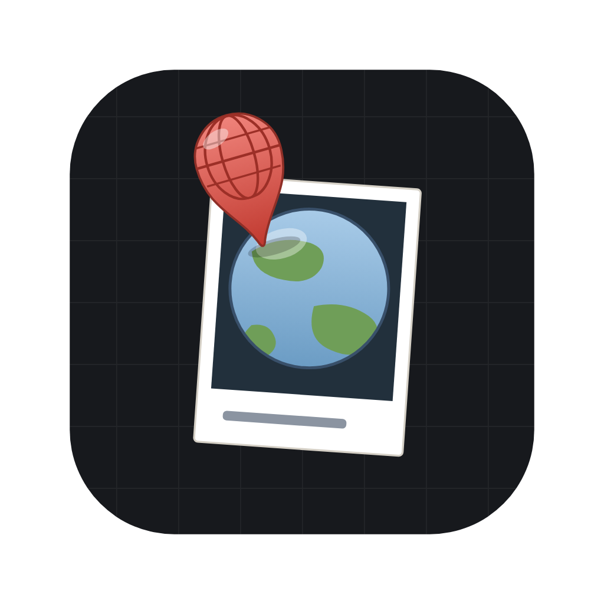

<p align="center">
  
</p>

# Expanding Worlds

An art-first reference board for building worlds. Pin images to an
infinite canvas, group them into frames, give anything a note, link
notes into a wiki, and dive into any image's own board — boards
nest inside boards, as deep as the world goes.

Think *PureRef × a scrapbook wiki*: everything is local, offline,
and yours. No accounts, no cloud, no telemetry. Your project is a
folder you can copy, back up, and open anywhere.

## Download

Grab the latest build from
[Releases](https://github.com/animegolem/expanding-worlds/releases):

- **macOS** (Apple Silicon): the `.dmg`
- **Windows**: the `Setup .exe`
- **Linux**: the `.AppImage`

**First launch — the builds are unsigned for now**, so your OS will
be suspicious once:

- **macOS**: on recent macOS (Sequoia/Tahoe) the old
  right-click → Open trick no longer works, and the app may not
  appear under Privacy & Security at all. Clear the quarantine flag
  once in Terminal after dragging it to Applications:

  ```
  xattr -cr "/Applications/Expanding Worlds.app"
  ```

  Then it opens normally forever. (On older macOS, right-click →
  **Open** → Open still works.)
- **Windows**: SmartScreen → **More info** → **Run anyway**.
- **Linux**: `chmod +x` the AppImage and run it.

## What it does today

- **Infinite boards** — drop, paste, or drag in images; move, scale,
  rotate, crop; snap and align with your hands, not dialogs.
- **Boards inside boards** — any image can open into its own canvas;
  the path bar remembers how you got there.
- **Frames** — group regions of a board, name them, auto-arrange
  what you drop inside.
- **Notes & wiki links** — every image can carry a note;
  `[[links]]` connect notes into a world; a full-text search and
  quick-open jump anywhere.
- **Tags, gallery, outline, trash** — booru-style tags with
  completion, a project-wide gallery, structural views, and a trash
  that actually restores things.
- **Undo that means it** — one Mod+Z per deliberate act, across
  moves, appearance, renames, tags, and bookmarks.
- **Portable projects** — one-file `.ewproj` export/import with a
  lossless round-trip, plus automatic local snapshots.

Active development — expect rough edges and a fast-moving pace. If
something feels wrong, it probably is; say so.

## Building from source

```
pnpm install
pnpm -r build
pnpm dev          # run the desktop app against live sources
pnpm -r test      # units + the full e2e suite (hidden windows)
```

Requires Node 22+ and pnpm. The desktop app is Electron; packaging
is `electron-builder` (see `apps/desktop/electron-builder.yml`).

## How this repo is organized

- `apps/desktop` — the Electron app (renderer, main, e2e).
- `packages/` — the engine: canvas renderer, domain model,
  persistence (SQLite), command protocol.
- `RAG/` — the project's brain: `RFC-0001-…` is the single
  normative spec; `AI-EPIC`/`AI-IMP` are the work tracker;
  `INDEX.md` is the kanban.

Built by a two-person crew: an owner/designer and an AI lead
developer, with the spec — not the conversation — as the source of
truth.
